# アプリケーション画面構成図 / Application Screen Layout

このダイアグラムは、Personal Finance Dashboardの画面構成と機能配置を示しています。

This diagram shows the screen layout and feature placement of the Personal Finance Dashboard.

```mermaid
%%{init: {'theme':'base', 'themeVariables': { 'primaryColor':'#e3f2fd','primaryTextColor':'#000','primaryBorderColor':'#1976d2','lineColor':'#1976d2','secondaryColor':'#f3e5f5','tertiaryColor':'#e8f5e9','noteBkgColor':'#fff3e0','noteTextColor':'#000','fontSize':'16px','fontFamily':'Arial'}}}%%

graph TB
    classDef mainScreen fill:#bbdefb,stroke:#1976d2,stroke-width:3px,color:#000,font-weight:bold
    classDef subScreen fill:#c5cae9,stroke:#5e35b1,stroke-width:2px,color:#000,font-weight:bold
    classDef feature fill:#b2dfdb,stroke:#00796b,stroke-width:2px,color:#000,font-weight:bold
    classDef action fill:#fff9c4,stroke:#f57f17,stroke-width:2px,color:#000,font-weight:bold
    classDef data fill:#f8bbd0,stroke:#c2185b,stroke-width:2px,color:#000,font-weight:bold

    APP[Personal Finance Dashboard<br/>家計管理ダッシュボード]:::mainScreen

    APP --> DASH[Dashboard<br/>ダッシュボード]:::subScreen
    APP --> ENTRY[Data Entry<br/>データ入力]:::subScreen
    APP --> BUDGET[Budget Management<br/>予算管理]:::subScreen
    APP --> MASTER[Master Management<br/>マスター管理]:::subScreen
    APP --> SETTINGS[Settings<br/>設定]:::subScreen

    DASH --> FILTER[Period Filter<br/>期間フィルター]:::feature
    DASH --> SUMMARY[Summary Cards<br/>サマリーカード]:::feature
    DASH --> CHARTS[Charts & Graphs<br/>チャート・グラフ]:::feature
    DASH --> HISTORY[Transaction History<br/>取引履歴]:::feature
    DASH --> EXPORT[Export Data<br/>データ出力]:::action

    SUMMARY --> TOTAL[Period Total<br/>期間合計]:::data
    SUMMARY --> AVG[Daily Average<br/>1日平均]:::data
    SUMMARY --> COUNT[Record Count<br/>レコード数]:::data
    SUMMARY --> SHOPS[Shop Count<br/>ショップ数]:::data

    CHARTS --> PIE[Shop Breakdown<br/>ショップ別円グラフ]:::data
    CHARTS --> BAR[Top 10 Categories<br/>カテゴリTOP10]:::data
    CHARTS --> LINE1[Daily Trend<br/>日別推移]:::data
    CHARTS --> LINE2[Cumulative Trend<br/>累積推移]:::data
    CHARTS --> STACK[Period Analysis<br/>期間別分析]:::data

    HISTORY --> TABLE[Transaction Table<br/>取引テーブル]:::data
    HISTORY --> EDIT[Edit/Delete<br/>編集・削除]:::action
    HISTORY --> SEARCH[Search & Filter<br/>検索・絞込]:::action

    ENTRY --> FORM[Transaction Form<br/>取引入力フォーム]:::feature
    ENTRY --> IMPORT[CSV Import<br/>CSV取込]:::action

    FORM --> DATE[Date<br/>日付]:::data
    FORM --> AMOUNT[Amount<br/>金額]:::data
    FORM --> SHOP[Shop<br/>ショップ]:::data
    FORM --> CATEGORY[Category<br/>カテゴリ]:::data

    BUDGET --> BUDGETSET[Budget Setting<br/>予算設定]:::feature
    BUDGET --> PROGRESS[Progress Tracking<br/>進捗追跡]:::feature
    BUDGET --> ALERT[Budget Alerts<br/>予算アラート]:::feature

    BUDGETSET --> MONTHLY[Monthly Budget<br/>月次予算]:::data
    PROGRESS --> VISUAL[Progress Bar<br/>進捗バー]:::data
    PROGRESS --> COMPARE[Budget vs Actual<br/>予算対実績]:::data

    MASTER --> SHOPMASTER[Shop Master<br/>ショップマスター]:::feature
    MASTER --> CATMASTER[Category Master<br/>カテゴリマスター]:::feature

    SHOPMASTER --> SHOPADD[Add Shop<br/>ショップ追加]:::action
    SHOPMASTER --> SHOPLIST[Shop List<br/>ショップ一覧]:::data

    CATMASTER --> CATADD[Add Category<br/>カテゴリ追加]:::action
    CATMASTER --> CATLIST[Category List<br/>カテゴリ一覧]:::data

    SETTINGS --> THEME[Theme Toggle<br/>テーマ切替]:::action
    SETTINGS --> LANG[Language Toggle<br/>言語切替]:::action

    THEME --> DARK[Dark Mode<br/>ダークモード]:::data
    THEME --> LIGHT[Light Mode<br/>ライトモード]:::data

    LANG --> JP[日本語]:::data
    LANG --> EN[English]:::data
```



## 画面構成の説明 / Screen Layout Description

### メインタブ / Main Tabs

1. **Dashboard (ダッシュボード)**
   - 期間選択フィルター
   - 4つのサマリーカード（合計、平均、レコード数、ショップ数）
   - 5種類のチャート（円グラフ、棒グラフ、折れ線グラフ×2、積み上げ棒グラフ）
   - 取引履歴テーブル（編集・削除・検索機能付き）
   - データエクスポート機能

2. **Data Entry (データ入力)**
   - 新規取引入力フォーム
   - CSV一括取込機能

3. **Budget Management (予算管理)**
   - 月次予算設定フォーム
   - 視覚的な進捗トラッキング
   - 予算アラート（80%警告、100%危険）
   - 予算対実績比較

4. **Master Management (マスター管理)**
   - ショップマスター管理（追加・一覧表示）
   - カテゴリマスター管理（追加・一覧表示）

### 共通機能 / Common Features

- **Theme Toggle**: ライトモード・ダークモード切替
- **Language Toggle**: 日本語・英語切替
- **Responsive Design**: モバイル対応レスポンシブデザイン
- **CRUD Operations**: 完全な作成・読取・更新・削除機能

### データフロー / Data Flow

```
ユーザー入力 → データベース保存 → ダッシュボード表示 → チャート描画
User Input → Database Storage → Dashboard Display → Chart Rendering
```

### 技術スタック / Technology Stack

- **Backend**: PHP 7.4+ (PDO)
- **Database**: MySQL 5.7+ / MariaDB 10.2+
- **Frontend**: Bootstrap 5.3
- **Charts**: Highcharts
- **Icons**: Bootstrap Icons

---

**更新日 / Last Updated**: 2025-10-25
