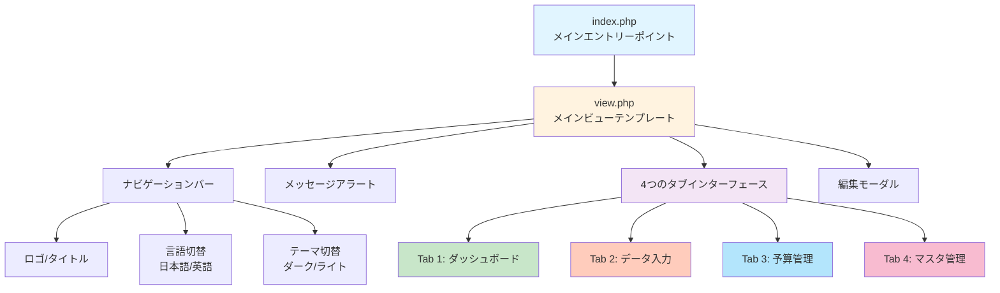
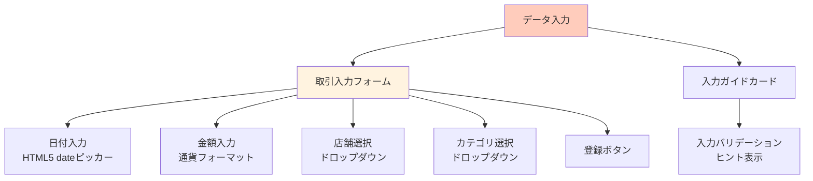
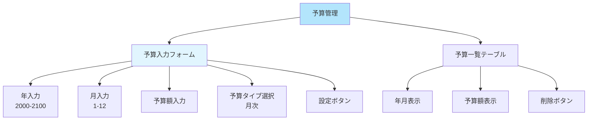
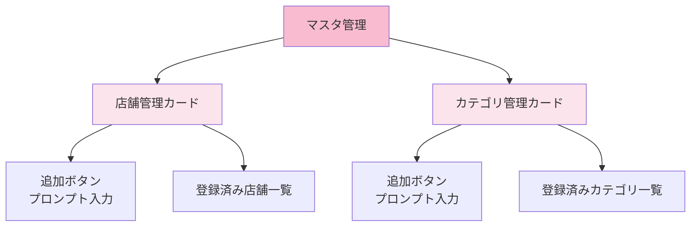
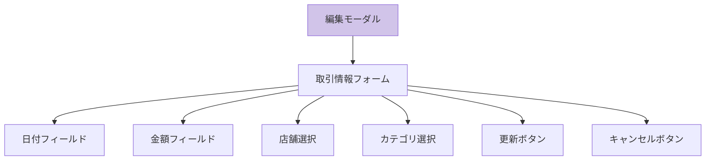
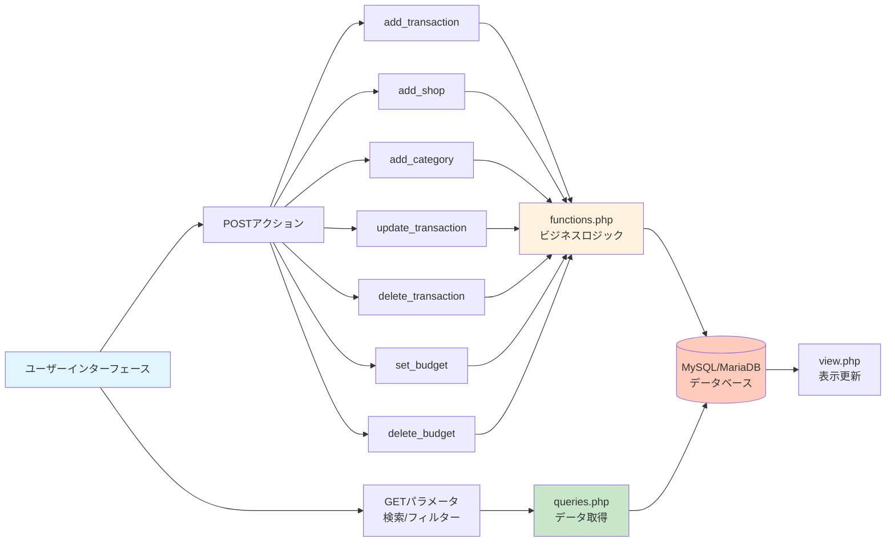
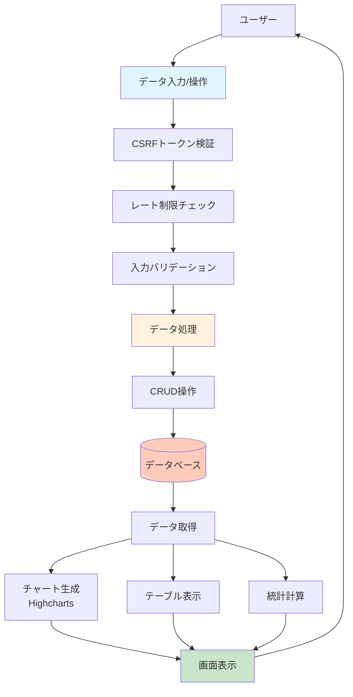

# 個人家計簿ダッシュボード - アプリケーション構造図

## アプリケーション全体構造



## Tab 1: ダッシュボード画面 (dashboard.php)

```mermaid
graph TB
    D[ダッシュボード] --> D1[期間選択セクション]
    D --> D2[サマリーカード]
    D --> D3[予算進捗バー]
    D --> D4[5つのチャート]
    D --> D5[取引履歴テーブル]
    D --> D6[検索結果セクション]

    D1 --> D1A[開始日/終了日<br/>日付選択]
    D1 --> D1B[リセットボタン]
    D1 --> D1C[エクスポートボタン]

    D2 --> D2A[総支出額]
    D2 --> D2B[1日平均額]
    D2 --> D2C[レコード数]
    D2 --> D2D[店舗数]

    D3 --> D3A[予算達成率表示]
    D3 --> D3B[残高/超過額表示]
    D3 --> D3C[アラート<br/>緑80%未満/黄80-99%/赤100%以上]

    D4 --> D4A[店舗別支出<br/>円グラフ]
    D4 --> D4B[カテゴリTop10<br/>棒グラフ]
    D4 --> D4C[日別支出推移<br/>折れ線グラフ]
    D4 --> D4D[累積支出<br/>折れ線グラフ]
    D4 --> D4E[期間比較<br/>積み上げ棒グラフ<br/>12ヶ月/2年/5年/10年]

    D5 --> D5A[日付/金額/店舗/カテゴリ]
    D5 --> D5B[編集ボタン]
    D5 --> D5C[削除ボタン]
    D5 --> D5D[表示件数選択<br/>20/100/500/1000件]

    D6 --> D6A[店舗フィルター<br/>クリック可能バッジ]
    D6 --> D6B[カテゴリフィルター<br/>クリック可能バッジ]
    D6 --> D6C[アクティブフィルター表示]

    style D fill:#c8e6c9
    style D4 fill:#fff9c4
    style D5 fill:#e1bee7
```



## Tab 2: データ入力画面 (entry.php)



## Tab 3: 予算管理画面 (budget.php)



## Tab 4: マスタ管理画面 (management.php)



## 編集モーダル



## バックエンド処理フロー



## データフロー



## 主要機能一覧

### データ管理機能
- ✅ 取引データの追加・編集・削除
- ✅ 店舗マスタの管理
- ✅ カテゴリマスタの管理
- ✅ CSV インポート/エクスポート

### 分析・可視化機能
- ✅ 期間別サマリー統計
- ✅ 店舗別支出分析（円グラフ）
- ✅ カテゴリ別分析（棒グラフ）
- ✅ 日別支出推移（折れ線グラフ）
- ✅ 期間比較分析（12ヶ月/2年/5年/10年）
- ✅ 予算vs実績トラッキング

### 予算管理機能
- ✅ 月次予算設定
- ✅ リアルタイム予算進捗追跡
- ✅ 3段階アラートシステム（緑/黄/赤）
- ✅ 残高・達成率表示

### フィルター・検索機能
- ✅ 日付範囲フィルター
- ✅ 店舗別フィルター
- ✅ カテゴリ別フィルター
- ✅ 表示件数選択（20/100/500/1000件）

### 多言語・テーマ機能
- ✅ 日本語/英語切替
- ✅ ダーク/ライトモード
- ✅ チャートの自動色調整

## 技術スタック

| レイヤー | 技術 |
|---------|------|
| フロントエンド | Bootstrap 5.3, HTML5, CSS3, JavaScript |
| チャート | Highcharts.js |
| バックエンド | PHP 7.4+ |
| データベース | MySQL 5.7+ / MariaDB |
| セキュリティ | CSRF トークン, レート制限, プリペアドステートメント |

## ファイル構成

```
/Personal-Finance-Dashboard/
├── index.php              # メインエントリーポイント
├── view.php               # メインビューテンプレート
├── config.php             # データベース接続・セキュリティ設定
├── functions.php          # ビジネスロジック（CRUD操作）
├── queries.php            # データ取得関数
├── translations.php       # 多言語文字列（日/英）
├── export.php             # CSV エクスポート
├── import.php             # CSV インポート
├── database.sql           # データベーススキーマ
├── assets/
│   ├── css/style.css     # カスタムスタイル
│   └── js/app.js         # チャート描画・UI インタラクション
└── views/
    ├── dashboard.php      # ダッシュボード画面
    ├── entry.php          # データ入力画面
    ├── budget.php         # 予算管理画面
    ├── management.php     # マスタ管理画面
    ├── transactions_table.php  # 取引履歴テーブル
    └── search_results.php      # 検索結果表示
```
